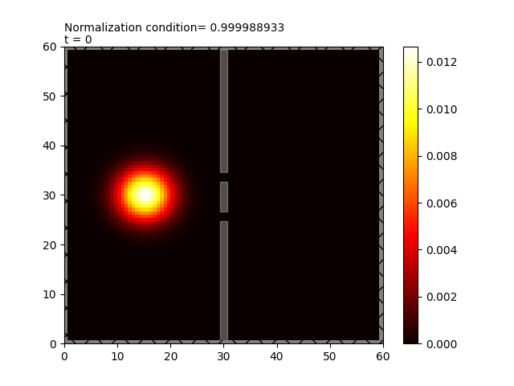

# Quantum wave packet diffusion with Cranck-Nicolson approximation

These two programs generate quantum Gaussian wave packets, give them an impulse, and then pass them through either a double slit or a crystal lattice using the Crank-Nicolson approximation.
For each of the two programs, you need to create a folder and provide the path to that folder at the beginning of the codes. The program saves an image per iteration in this folder to create an .mp4 video at the end of the simulation.

You can remove the slits, create a wall with more or less potential to create a quantum tunnelling, or create any potential you want. You can also change the impulse of the wave packet or add particles.

We consider the 2D Schrödinger equation in atomic units.

$$
i\frac{\partial \Psi}{\partial t} = -\frac{1}{2}\left(\frac{\partial^2 \Psi}{\partial x^2}+\frac{\partial^2 \Psi}{\partial y^2}\right) + V\Psi
$$

$$
x=j dx
$$

$$
y=i dy
$$

$$
t=n dt
$$

$$
i,j = (0,1,2,...,N-2,N-1)
$$

$$
t = (0,1,2,...,N_t-2,N_t-1)
$$

The time derivative is written as:

  $$\frac{\partial \Psi_{n,i}}{\partial t}=\frac{\Psi^{n+1}_{i,j}+\Psi^n_{i,j}}{\Delta t}$$

The spatial derivatives are written as:

$$\frac{\partial^2 \Psi^n_{i,j}}{\partial x^2}=\frac{1}{2\Delta x^2}\left(\Psi^{n+1}_{i,j+1}-2\Psi^{n+1}_{i,j}+\Psi^{n+1}_{i,j-1}+\Psi^{n}_{i,j+1}-2\Psi^{n}_{i,j}+\Psi^{n}_{i,j-1}\right)$$

$$\frac{\partial^2 \Psi^n_{i,j}}{\partial y^2}=\frac{1}{2\Delta y^2}\left(\Psi^{n+1}_{i+1,j}-2\Psi^{n+1}_{i,j}+\Psi^{n+1}_{i-1,j}+\Psi^{n}_{i+1,j}-2\Psi^{n}_{i,j}+\Psi^{n}_{i-1,j}\right)$$

We consider $\Delta y = \Delta x$.

We set:

$$\alpha = \frac{i \Delta t}{4 \Delta x^2}$$

We place all the indices n+1 on the left and the indices n on the right:

$$-\alpha \left(\Psi^{n+1}_{i,j+1}+\Psi^{n+1}_{i+1,j}\right) +(1+4\alpha +\frac{i\Delta t}{2}V^{n+1}_{i,j}) \Psi^{n+1}_{i,j} -\alpha \left(\Psi^{n+1}_{i,j-1}+\Psi^{n+1}_{i-1,j}\right) = \alpha \left(\Psi^{n}_{i,j+1}+\Psi^{n}_{i+1,j}\right) +(1-4\alpha -\frac{i\Delta t}{2}V^{n}_{i,j}) \Psi^{n}_{i,j} +\alpha \left(\Psi^{n}_{i,j-1}+\Psi^{n}_{i-1,j}\right)$$

$$[A]\Psi_{n+1}=[B]\Psi_{n}$$

We will organize the matrices to calculate the wave function at the next time step at all points at once. We define a new index:  $k=jN+i$.

We set:

$$\lambda^{+}_k = 1+4\alpha +\frac{i\Delta t}{2}V^{n+1}_{i,j}$$

Example of the form of matrix A and vector $\\Psi^{n+1}\$ pour N=4 :

  $$
\begin{pmatrix}
  \lambda^{+}_0 & -\alpha & 0 & 0 & -\alpha & 0 & 0 & 0 & 0 & 0 & 0 & 0 & 0 & 0 & 0 & 0\\
  -\alpha & \lambda^{+}_1 & -\alpha & 0 & 0 & -\alpha & 0 & 0 & 0 & 0 & 0 & 0 & 0 & 0 & 0 & 0\\
  0 & -\alpha & \lambda^{+}_2 & -\alpha & 0 & 0 & -\alpha & 0 & 0 & 0 & 0 & 0 & 0 & 0 & 0 & 0\\
  0 & 0 & -\alpha & \lambda^{+}_3 & -\alpha & 0 & 0 & -\alpha & 0 & 0 & 0 & 0 & 0 & 0 & 0 & 0\\
  -\alpha & 0 & 0 & -\alpha & \lambda^{+}_4 & -\alpha & 0 & 0 & -\alpha & 0 & 0 & 0 & 0 & 0 & 0 & 0\\
  0 & -\alpha & 0 & 0 & -\alpha & \lambda^{+}_5 & -\alpha & 0 & 0 & -\alpha & 0 & 0 & 0 & 0 & 0 & 0\\
  0 & 0 & -\alpha & 0 & 0 & -\alpha & \lambda^{+}_6 & -\alpha & 0 & 0 & -\alpha & 0 & 0 & 0 & 0 & 0 \\
  0 & 0 & 0 & -\alpha & 0 & 0 & -\alpha & \lambda^{+}_7 & -\alpha & 0 & 0 & -\alpha & 0 & 0 & 0 & 0 \\
  0 & 0 & 0 & 0 & -\alpha & 0 & 0 & -\alpha & \lambda^{+}_8 & -\alpha & 0 & 0 & -\alpha & 0 & 0 & 0 \\
  0 & 0 & 0 & 0 & 0 & -\alpha & 0 & 0 & -\alpha & \lambda^{+}_9 & -\alpha & 0 & 0 & -\alpha & 0 & 0 \\
  0 & 0 & 0 & 0 & 0 & 0 & -\alpha & 0 & 0 & -\alpha & \lambda^{+}_{10} & -\alpha & 0 & 0 & -\alpha & 0 \\
  0 & 0 & 0 & 0 & 0 & 0 & 0 & -\alpha & 0 & 0 & -\alpha & \lambda^{+}_{11} & -\alpha & 0 & 0 & -\alpha \\
  0 & 0 & 0 & 0 & 0 & 0 & 0 & 0 & -\alpha & 0 & 0 & -\alpha & \lambda^{+}_{12} & -\alpha & 0 & 0  \\
  0 & 0 & 0 & 0 & 0 & 0 & 0 & 0 & 0 & -\alpha & 0 & 0 & -\alpha & \lambda^{+}_{13} & -\alpha & 0  \\
  0 & 0 & 0 & 0 & 0 & 0 & 0 & 0 & 0 & 0 & -\alpha & 0 & 0 & -\alpha & \lambda^{+}_{14} & -\alpha  \\
  0 & 0 & 0 & 0 & 0 & 0 & 0 & 0 & 0 & 0 & 0 & -\alpha & 0 & 0 & -\alpha & \lambda^{+}_{15}  \\
\end{pmatrix}
\begin{pmatrix}
  \Psi_{0}=\Psi_{0,0}  \\
  \Psi_{1}=\Psi_{1,0}  \\
  \Psi_{2}=\Psi_{2,0}  \\
  \Psi_{3}=\Psi_{3,0}  \\
  \Psi_{4}=\Psi_{0,1}  \\
  \Psi_{5}=\Psi_{1,1}  \\
  \Psi_{6}=\Psi_{2,1}  \\
  \Psi_{7}=\Psi_{3,1}  \\
  \Psi_{8}=\Psi_{0,2}  \\
  \Psi_{9}=\Psi_{1,2}  \\
  \Psi_{10}=\Psi_{2,2}  \\
  \Psi_{11}=\Psi_{3,2}  \\
  \Psi_{12}=\Psi_{0,3}  \\
  \Psi_{13}=\Psi_{1,3}  \\
  \Psi_{14}=\Psi_{2,3}  \\
  \Psi_{15}=\Psi_{3,3}  \\
\end{pmatrix}
_{n+1}
  $$

The normalized Gaussian initial wave function is expressed as follows:

$$\Psi_0(x) = \sqrt{\frac{\Delta k_y\Delta k_x}{\pi}} \ e^{\pm ik_{0x} x \pm ik_{0y} y} \ e^{-\frac{\Delta k_{x}^2x^2}{2}-\frac{\Delta k_{y}^2y^2}{2}}$$

The dispersion relation is:

$$\omega=\frac{k_{x}^2+k_{y}^2}{2}$$

It is therefore necessary to solve:

$$\Psi^{n+1}=[A]^{-1}[B]\Psi^{n}$$

if the potential does not depend on time, $[A]^{-1}[B]$ is constant and is calculated only once.

**Example of initial condition for the simulation of the double slit**

